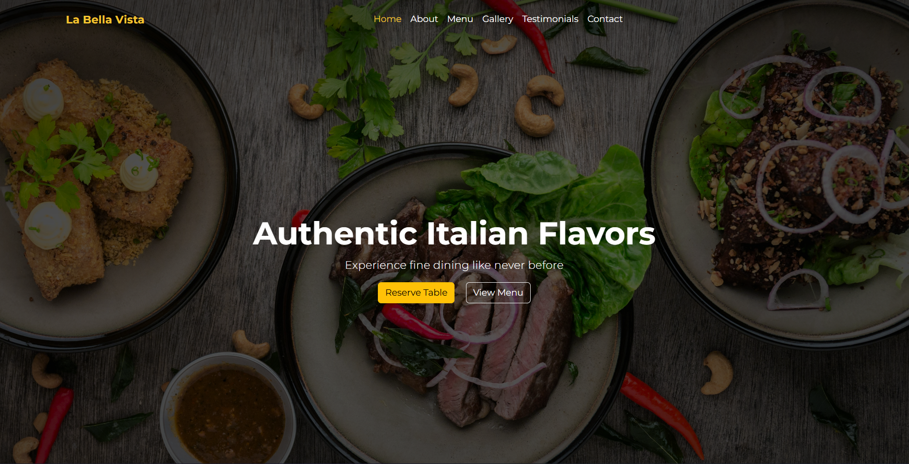
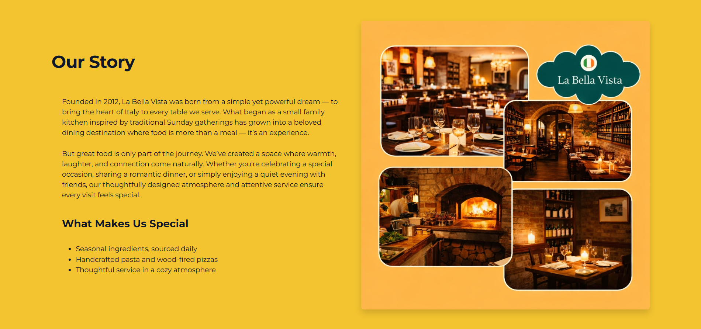
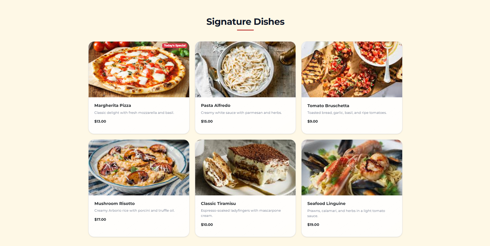
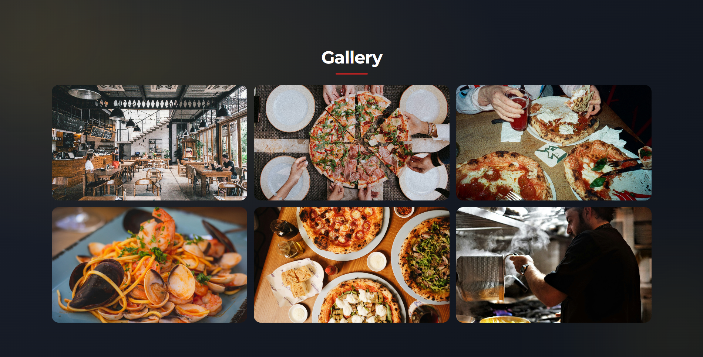
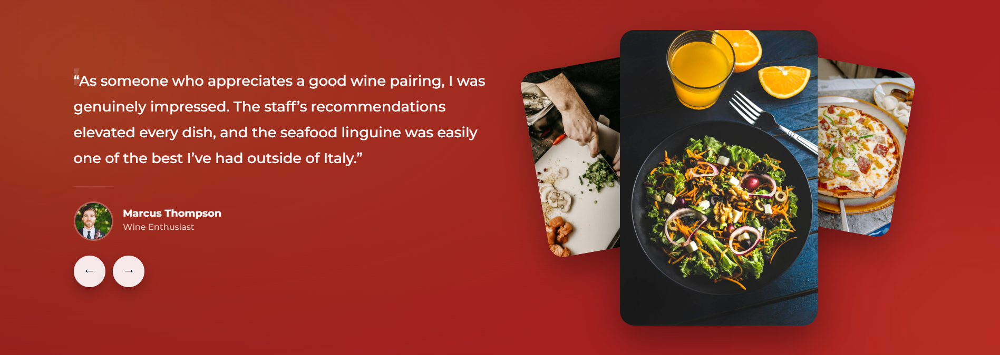
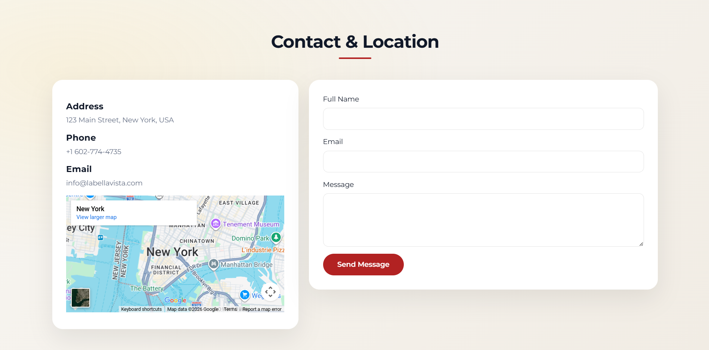
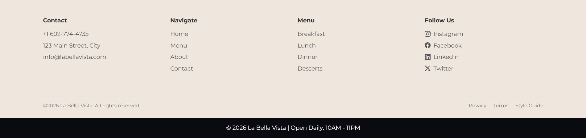

# 🍝 La Bella Vista – Restaurant Landing Page

A fully responsive, single-page restaurant marketing website built using HTML, CSS, Bootstrap, and Vanilla JavaScript.

This project was created as part of a front-end development assignment focused on layout design, responsiveness, UI polish, accessibility, and JavaScript interactions.

---

## 🚀 Live Demo
(Add your GitHub Pages / Netlify link here if deployed)

---

## 📌 Project Overview

La Bella Vista is a fictional Italian fine-dining restaurant website designed to:

- Showcase signature dishes
- Highlight ambience and dining experience
- Display testimonials
- Provide contact & location information
- Allow users to send booking inquiries

The website is fully responsive and optimized for mobile, tablet, and desktop screens.

---

## 🛠 Tech Stack

- **HTML5**
- **CSS3**
- **Bootstrap 5**
- **Vanilla JavaScript**
- Google Fonts (Montserrat)

No external frameworks were used.

---

## ✨ Features

### 🔹 Hero Section
- Tagline and branding
- Call-to-action buttons (Reserve Table / View Menu)

### 🔹 About Section
- Restaurant story
- Feature highlights
- Responsive layout with image

### 🔹 Menu Highlights
- 6 signature dishes
- Responsive Bootstrap card layout
- “Today’s Special” badge (JS controlled)

### 🔹 Gallery
- Responsive image grid
- Click-to-expand lightbox (Bootstrap modal)

### 🔹 Testimonials
- Bootstrap carousel
- 5 customer reviews
- Custom navigation controls

### 🔹 Contact & Location
- Address, phone, email
- Embedded Google Map (iframe)
- Contact form with JavaScript validation:
  - Required fields
  - Email format validation
  - Minimum character length

### 🔹 Navigation
- Sticky navbar
- Smooth scroll
- Active link highlight

### 🔹 Optional Enhancements
- Dark mode toggle (persisted via localStorage)
- Scroll reveal animations
- Micro-interactions & hover effects
- SEO meta tags

---

## 📱 Responsiveness

The layout uses Bootstrap’s grid system and utility classes to ensure:

- No horizontal scrolling
- Proper stacking on small screens
- Optimized spacing and typography across devices

---

## ♿ Accessibility Considerations

- Semantic HTML sections
- Proper `<label>` associations
- Alt text for all images
- Visible focus states for form inputs
- Sufficient color contrast

---

## 📂 Project Structure

restaurant-landing-page/
│
├── index.html
├── README.md
│
├── css/
│ └── custom.css
│
├── js/
│ └── main.js
│
└── assets/
├── about.png
├── menu images
├── testimonial images
└── gallery/

---

## ▶️ How to Run Locally

1. Clone the repository: git clone https://github.com/NeoSoham/Restaurant-Landing-Page.git

2. Open the project folder.

3. Open `index.html` in your browser.

No additional setup required.

---

## 📸 Screenshots

---

## 📈 Evaluation Criteria Covered

- Layout & responsiveness
- Visual polish & typography
- JavaScript interactions & validation
- Accessibility basics
- Code cleanliness & organization

---

## 📜 License

This project is created for educational purposes.

---

## 👨‍💻 Author

Developed by: Soham Neogy
